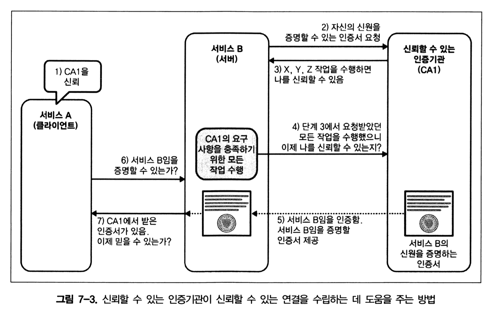
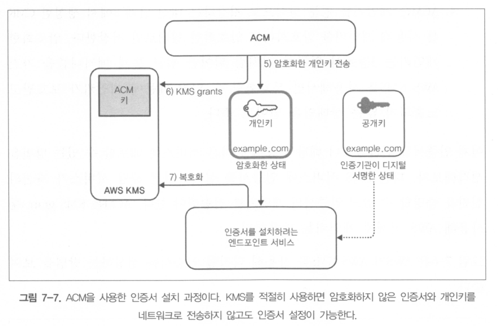

# 7장 전송 보안
- 모놀리식 아키텍쳐의 경우 모듈 간 통신이 인메모리에서 해결되지만!
	- 마이크로서비스는 모듈 간 통신을 외부 전송(네트워크 등)에 의지
	- 외부 통신 채널은 악의적인 행위자의 잠재적 위협에 더 취약
- 마이크로서비스 모듈간 통신 구현 방법
	1. 비동기 REST 호출
	2. SQS 같은 메시지 큐 사용하거나 Kafka같은 메시지 브로커 사용
	3. gRPC같은 HTTP, HTTP2 기반 wrapper 사용
	4. Istio나 App Mesh 같은 서비스 메시 사용
- TLS는 전송 중인 데이터 암호화하는 가장 일반적인 방법
## TLS 기초
- HTTP 통신 과정에서 데이터 유출 2가지 방법
	- 피싱(Phishing): 서비스를 사칭하여 정보 탈취
	- 중간자 공격(man in the middle attack): 서비스와 클라이언트 간 정상적으로 교환하는 데이터를 중간에서 탈취
- TLS는 위 잠재적 위험을 줄여줌
	- 인증
		- TLS 통신에서 통신 당사자인 클라이언트와 서버 모두는 신뢰할 수 있는 인증기관(trusted CA)으로 불리는 서드파티에게 인증 작업을 위임하는데 동의함
		- CA는 디지털 인증서와 공개키 암호화를 사용해 신원 검증
	- 암호화
		- 종단 간 암호화
		- 중간자 공격이나 통신 채널 하이재킹 공격을 방지
- 디지털 서명
	- 데이터 무결성 보장
	- 통신 상대방이 비대칭 암호화를 사용해 데이터의 진위를 검증할 수 있게 개인키를 사용해 문서를 암호화하는 프로세스
	- 개인키로 암호화 공개키로 복호화
- 인증서, 인증기관, 신원 검증
	- TLS는 디지털 인증서 형식의 공개키 암호화를 사용해 인증 수행
	- 디지털 인증서: 전자 서명을 기반으로 개인키의 소유권을 증명하는 전자 문서
	- TLS 인증의 목적은 서버가 클라이언트에게 자신의 신원을 증명하는 것
	- 
	- 클라이언트와 서버 사이 제 3자가 있어 인증서 검증 가능
	- 서비스 B의 개인키 획득하면 인증서 사용해 서비스 B 사칭 가능
		- 유출되면 디지털 인증서 무효화, TLS 인증서 해지 해야함
- ACM(AWS Certificate Manager)
	- ACM 인증서: 인증서가 포함하는 공개키와 서비스(URL)를 연결하는 X.509 TLS 인증서
	- URL의 운전 면허증 역할
	- AWS는 모든 서비스의 개인키와 공개키를 관리하고 서비스의 인증서를 자동으로 갱신하며, 사설 인증기관 역할을 수행함
- 아마존 Trust Services
	- 공용 인증기관
	- 도메인에 대한 인증서 생성 > 아마존 Trust Services 통해 신원 확인 > 인증서 부여
- ACM 작동 원리
	- 
	- 
- 도메인 소유권 검증
	- 이메일로 검증: 인증서에 나열된 도메인의 등록된 소유자에게 이메일을 보내고 아마존 인증서 승인 웹 사이트에 접속해 요청 승인해야함
	- DNS로 검증: CNAME 레코드를 사용해 인증서 요청 측이 도메인을 소유하거나 제어할 수 있는지 확인함
- 공용 인증기관 vs 사설 인증기관
	- 공용 사용 시 최종 소비자가 누구일지 예상할 수 없는 대외 서비스에서 사용
	- 사설 사용 시 마이크로서비스 환경 등에서 애플리케이션 끼리 내부에서 인증이 필요한 경우 사용
		- 도메인 소유권 증명 필요 없이 내부 도메인 사용
		- AWS App Mesh 같은 서비스는 원활하게 통합할 수 있어 설정이 더 간단
- TLS 암호화
	- 종단간 암호화
	- TLS 자체가 암호화 알고리즘은 아니기 때문에 TLS는 클라이언트<>서버가 통신에 가장 적합한 암호화 형식을 상호 결정하고자 수행하는 특정 과정이 필요 > 핸드셰이크
	- TLS 핸드셰이크: 대칭 키 알고리즘 사용. AWS 서비스들은 다양한 암호화 형식을 지원하여 폭포수 프로세스(서버가 지원하는 암호화 형식 목록을 내림차순으로 생성하는 구조)를 기반으로 가장 강력한 암호화 형식 선택함
- PFS(Perfect Forward Secrecy)
	- 암호화에 사용하는 키 손상은 매우 위험함. TLS 설정에서 PFS를 지원하는 알고리즘 사용 시 서버 키 손상돼도 전체 세션 데이터가 손상되지 않게 할 수 있음
	- 공격자가 클라이언트와 서버 간의 암호화된 통신을 도감청 하거나 내용을 저장한 경우, 개인키가 노출되었다면 개인키를 이용하여 기존에 저장된 암호문을 모두 해독할 수 있습니다. (물론 개인키가 노출되지 않고 잘 관리된다면 암호문은 해독 불가 합니다.) 만약 PFS가 활성화된 Cipher-Suite로 클라이언트와 서버 간의 암호화 통신이 이루어졌다면 개인키가 노출되더라도 기존에 저장된 암호문을 해독할 수 없도록 하는 장치가 PFS입니다.
## 마이크로서비스 환경의 TLS 종료와 종료 지점별 장단점
- TLS 종료 지점: 시스템에서 TLS 관련 작업을 처리하는 지점. TLS 오프로딩(offloading)이라고 하기도 함
	- 엣지 시스템을 TLS 종료 지점으로 지정: 엣지 시스템 뒷 단에 위치한 프라이빗 네트워크가 완전한 프라이빗 환경인 경우 적합
		- 다만 신뢰 영역 내로 들어오면 TLS 인증을 거치지 않아 위험하면서 효율적인 구조가 됨
	- 종료 지점이 앱에 가까울수록 안전해지나 불필요한 핸드셰이크 과정이 늘어남
	- AWS 서비스가 TLS 종료하려면 ACM 사용해 TLS 오프로딩 담당하는 서비스 상에 TLS인증서 설치해야함
- 로드밸런서나 CDN에서 TLS 종료
	- ALB에서 지원하며 X.509 인증서 필요로 함
	- NLB에서는 TLS 종료하지 않는 옵션이 있어 TLS 패스스루(Passthrough)를 통해 종단 간 암호화 허용 가능. NLB에서 TLS 종료도 가능
	- CF 배포에 ACM 인증서 설치하고 TLS 종료
		- 여러 웹사이트가 같은 IP 주소를 공유하는 경우 특정 IP 주소를 대상으로 한 요청을 수신한 경우 적절한 인증서 제공이 어려움
			- SNI(Server Name Indication)로 불리는 기술 사용해 요청에 해당하는 인증서를 알아냄
			- 단독 주택이 아닌 다세대 주택 주소로 우편물 보내기와 비슷
- 애플리케이션이나 마이크로서비스 컨테이너가 TLS 종료

## 전송 암호화 적용 시 발생 비용과 복잡성
- ACM 공용 인증서는 무료
- 사설 인증서는 일반적으로 일회성 요금이 발생하지만 예외적으로 개인키를 최종 사용자에게 노출하지 않는 ELB같은 AWS 서비스에 설치된 사설 인증서는 요금이 발생하지 않음.
- ACM 사설 인증 기관은 월 사용료 400$
## 마이크로서비스에 TLS 적용
- SQS 같은 메시지 큐 사용하거나 Kafka같은 메시지 브로커 사용
	- 도메인간 상호 의존성을 줄임
	- 서비스가 일시 중단 되더라도 메시지 유실하지 않음
	- 메시지를 큐에 배치한 이후: KMS로 암호화 저장
	- 생산자 > 메시지 큐 도착 전: TLS 연결 적용 (IAM 정책 사용)
		- aws:SecureTransport: false condition을 적용해 TLS 사용하지 않은 큐에 대한 연결 요청 거부
- gRPC와 ALB
	- gRPC는 마이크로서비스간 통신에 점점 많이 사용하는 인기 프로토콜
	- ALB에서 프로토콜 버전에서 HTTP1, HTTP2, gRPC 선택 가능
- mTLS
	- TLS: 서버 검증, mTLS: 클라이언트 검증 추가
	- 서버 측에서 TLS를 종료하는데 사용할 수 있는 LB 뿐 아니라 outbound 요청을 생성하려는 클라이언트에 개별적으로 서명된 인증서를 설치해야 함을 의미
	- 복잡하여 상당한 투자가 필요함. AWS 관리형 서비스끼리 통신때는 쉽게 구현 가능(ex. Lambda <> API Gateway)
## 서비스 메시에 대한 보안 관점의 간략한 소개
- 서비스 메시 도입 전에는 TLS 종료, 모니터링 추적 로깅에 관한 로직이 앱에 포함되어 있어야 했음
	- 파드와의 통신 관련한 모든 측면을 프록시 서버에 맡김 (Sidecar 형식). Istio에선 Envoy proxy 사용함
	- 네트워크 활동을 프록시에 전적으로 맡김
	- 마이크로서비스마다 존재하게 되는 프록시의 동기화를 위해 (TLS 인증서 관리 등) 중앙 집중식 컨트롤 플레인 기용
		- AWS App Mesh
		- Istion Control Plane
- App Mesh 구성 요소
	- 메시(mesh): 마이크로서비스 네트워크
	- 가상 서비스(Virtual service): 마이크로서비스를 추상화한 서비스
	- 가상 게이트웨이(Virtual Gateway): Network Gateway처럼 작동하면서 메시 외부의 리소스가 메시 내부의 리소스와 통신할 수 있게 해줌. 가상 서비스들을 식별하는 자체 경로를 가짐
	- 가상 노드(Virtual node): deployment같은 특정 작업 그룹을 선별함. 모든 인바운드 트래픽을 리스너로 지정하고 가상노드에서 아웃바운드 트래픽을 보내는 모든 가상 서비스는 백엔드로 지정
	- 메시 엔드포인트(Mesh Endpoint): 가상 게이트웨이와 가상 노드를 함께 묶어서 칭함
	- 가상 라우터(Virtual router): 가상 서비스에 대한 트래픽을 특정 노드로 라우팅할 수 있는 기능을 갖춘 가상 서비스. HTTP, HTTP2, gRPC 라우팅 수행
	- 리스너(Listner): 인바운드 요청을 수신하는 엔드포인트 일부분
	- 백엔드(Backend): 인프라 내 다른 구성 요소에게 아웃바운드 요청을 보내는 엔드포인트의 일부분
- http://balanceservice.local/getBalance/{id} 요청 왔을 때?
	- 가상 게이트웨이(엣지에서 인바운드 트래픽 받고 TLS 종료) > 목적지 경로 확인하고 적절 가상 서비스로 요청 전달 > 요청을 가상 라우터로 전달 > 라우팅 경로(target)를 확인해 수신한 요청 처리할 노드 결정 > 가상 노드는 컨테이너와 함께 요청 처리하고 응답 제공
- TLS와 App Mesh
	- TLS 검증과 종료 처리를 Envoy Proxy에 맡김
	- ACM 사설 인증기관과 연동
- mTLS 재논의
	- 모든 클라이언트의 TLS 인증 관리 절차가 복잡
	- App Mesh가 이를 최신 상태로 유지할 수 있게 도움을 주어 mTLS를 완벽히 지원함
	- mTLS 작동하려면 클라이언트와 서버 모두 동일한 인증기관의 인증서 사용해야 함
- 서비스메시에는 Istio, Consul, Linkerd 등이 있다.
## 서버리스 마이크로서비스와 전송 암호화
- API Gateway는 주로 네트워크 경계에서 작동하며 인바운드 요청을 수락하는 기능 제공함
	- HTTP API 호출해 아마존 VPC 내부 리소스에 접근 가능. VPC 링크 생성 필요. ALB/NLB나 CloudMap과 연결
- API Gateway는 응답을 캐시해 응답속도를 높이고 엔드포인트 호출 수를 줄임
	- 캐시한 데이터를 암호화함
	- 공격자는 캐시 무효화를 시도할 수 있는데 이를 막고자 인가된 클라이언트에게만 캐시 무효화할 수 있게 IAM 정책 지정 가능 (execute-api:InvalidateCache)
## 필드 수준 암호화
- 안전한 경계 내부에 있는 마이크로서비스만 개인키를 사용해 데이터에 접근할 수 있도록 비대칭키 암호화 사용함
- CloudFront에서 설정 가능
	- 민감 데이터를 복호화 할 수 있는 마이크로서비스는 공개키를 CF배포와 공유함으로서 공개키를 엣지 로케이션에 배포함
	- 민감 데이터는 마이크로서비스가 공유한 공개키 사용해 암호화
	- 민감 데이터는 개인키로 복호화해 열람 가능
	- 개인키는 비밀 문자열이고 안전한 마이크로서비스만 알고 있어 다른 서비스는 복호화 불가능
- 이점
	- 엣지에서 민감함 평문 데이터를 암호화해 폭발 반경이 줄어들음. AWS에서 암호화 처리 책임이 있어 운영 오버헤드가 줄어듬
	- 다른 마이크로서비스는 민감한 평문 데이터 처리할 필요가 없어 엄격한 데이터 보호 프로토콜 준수할 필요 없음
	- 암호화하지 않은 데이터가 프라이빗 AWS 네트워크를 벗어나지 않기 때문에 PCI-DSS 같은 다양한 규제 표준 충족하기 수월함